# 🍽️ Restaurant Order Management System

## Overview

A comprehensive web-based system designed to replace paper-based order tracking in restaurants. Features QR code-based customer ordering, real-time order tracking with per-item status management, role-based staff access, and comprehensive analytics dashboard.

**Key Features:**

- 📱 QR code table ordering (no customer login required)
- 👨‍🍳 Per-dish status tracking (NEW → PREPARING → READY → COMPLETED)
- 👥 Role-based access (Owner, Staff, Customer)
- 📊 Real-time analytics with Thai Baht (฿) currency
- 🇹🇭 Thai timezone support (Asia/Bangkok, UTC+7)
- ☁️ AWS S3 image upload for menu items
- 🔄 Auto-refresh order status for customers (5-second intervals)

---

## Problem Statement

Many restaurants still rely on handwritten order slips to manage customer orders.
This manual process can lead to:

- Lost or misplaced order tickets
- Miscommunication between staff and kitchen
- Delayed order preparation
- Lack of real-time order visibility
- No structured sales data for analysis

This system digitizes the ordering workflow to improve operational efficiency and reduce human error.

---

## Objectives

The main goals of the system are:

- Digitize manual restaurant order tracking
- Implement structured order lifecycle management
- Enforce role-based access control
- Improve operational transparency
- Provide basic analytics for restaurant owners

---

## 📑 Table of Contents

1. [Overview](#overview)
2. [Problem Statement](#problem-statement)
3. [Objectives](#objectives)
4. [System Features](#-system-features)
5. [User Roles & Permissions](#-user-roles--permissions)
6. [System Workflow](#-system-workflow)
7. [Technology Stack](#-technology-stack)
8. [Project Structure](#-project-structure)
9. [How to Run the Project](#-how-to-run-the-project)
10. [API Endpoints](#-api-endpoints)
11. [Key Implementation Details](#-key-implementation-details)
12. [System Architecture Overview](#-system-architecture-overview)
13. [Troubleshooting](#-troubleshooting)
14. [Screenshots](#-screenshots)

---

## 🎯 System Features

### 📱 Mobile-Responsive Design

- **Mobile-First Interface**: Optimized layouts for phones, tablets, and desktops
- **Responsive Breakpoints**: Tailwind CSS breakpoints (sm/md/lg/xl) for fluid layouts
- **Touch-Optimized**: Larger tap targets and gesture-friendly interactions
- **Hamburger Navigation**: Collapsible sidebar menu on mobile devices
- **Adaptive Grids**: 2-column mobile layouts expanding to 4+ columns on desktop
- **Responsive Typography**: Font sizes and spacing adjust for screen size

### 🔐 Authentication & Authorization

- JWT-based authentication (30-minute token expiration)
- Role-based access control (Owner, Staff)
- Auto-logout on token expiration
- Secure password hashing with bcrypt

### 📋 Order Management

- **QR Code Ordering**: Customers scan table QR codes to access menu
- **Per-Item Status Tracking**: Each dish tracks independently through kitchen workflow
- **Status Flow**: NEW → PREPARING → READY → COMPLETED
- **Item Cancellation**: Cancel individual items (only if status is NEW and order not paid)
- **Payment Tracking**: Mark orders as paid (requires ALL items COMPLETED)
- **Real-time Updates**: Customer page auto-refreshes every 5 seconds
- **Order History**: View all orders with detailed timestamps

### 🍱 Menu Management

- Full CRUD operations for menu items (Owner only)
- **Image Upload**: AWS S3 integration for menu item photos
- **Availability Toggle**: Staff can enable/disable menu items
- Category organization (appetizers, mains, desserts, beverages)
- Price management in Thai Baht (฿)
- Menu item descriptions for customers

### 📊 Analytics & Reporting (Owner Only)

- **Overall Statistics**:
  - Total revenue (paid orders)
  - Order counts
  - Average order value
  - Average preparation time
- **Daily Sales Summary**: Revenue and order counts for past 7 days

- **Top Selling Items**: Best performers by quantity and revenue

- **Revenue by Category**: Category-wise sales breakdown

- **Hourly Distribution**: Order patterns throughout the day

- **Order Status Breakdown**: Visual distribution of order statuses

### 🛠️ Staff Management

- Create and manage staff accounts (Owner only)
- Separate staff portal with limited access:
  - View and update orders
  - Toggle menu availability
  - No access to analytics, tables, or staff management

### 🏢 Table Management

- Pre-configured tables (1-20)
- Unique QR code for each table
- Active order tracking per table
- Automatic table status management

---

## 👥 User Roles & Permissions

### 🧑‍💼 Customer / Table Session

**Access Method**: Scan QR code at restaurant table (no login required)

**Capabilities:**

- Browse menu with item descriptions and images
- View prices in Thai Baht (฿)
- Add items to cart and place orders
- View real-time order status with auto-refresh
- Cancel individual items (only if status is NEW and order not paid)
- See order status summary ("2 of 5 items ready")

**Restrictions:**

- Cannot access other tables' orders
- Cannot cancel items after kitchen starts preparation
- Cannot cancel items from paid orders

---

### 👨‍🍳 Staff (Kitchen / Server)

**Access Method**: Login with staff credentials

**Capabilities:**

- View all active orders in real-time
- Update per-item status (advance dishes through workflow)
- Cancel NEW items if requested
- Toggle menu item availability
- Mark orders as paid when customer settles bill

**Restrictions:**

- Cannot create, edit, or delete menu items
- Cannot access analytics dashboard
- Cannot manage staff accounts or tables
- No access to owner-only features

**Navigation:**

- Orders (view and manage)
- Menu (toggle availability only)

---

### 🏢 Restaurant Owner

**Access Method**: Login with owner credentials

**Full System Access:**

**Menu Management:**

- Create new menu items with images
- Edit existing items (name, price, category, description)
- Delete menu items
- Upload images to AWS S3
- Toggle availability

**Order Management:**

- All staff capabilities
- View all orders (past and present)
- Full order history access

**Analytics Dashboard:**

- Revenue tracking and trends
- Top selling items analysis
- Category performance
- Hourly order distribution
- Order status breakdowns

**System Administration:**

- Create and delete staff accounts
- Manage restaurant tables
- Generate QR codes for tables
- View comprehensive reports

**Navigation:**

- Dashboard (overview)
- Orders (full management)
- Menu (full CRUD)
- Staff (account management)
- Tables (QR code management)
- Analytics (comprehensive reports)

---

## 🔄 System Workflow

### Customer Ordering Flow

1. **Customer scans QR code** at their table
2. **Menu displays** with categories, images, prices (฿), and descriptions
3. **Customer adds items** to cart
4. **Order is placed** → All items start with status **NEW**
5. **Customer views order** with real-time status updates (auto-refresh every 5s)
6. Customer can **cancel individual items** while status is NEW

### Kitchen Workflow (Staff)

1. **Order appears** in staff dashboard
2. Staff **advances each dish** through statuses:
   - **NEW** → "Start Preparing" → **PREPARING**
   - **PREPARING** → "Mark Ready" → **READY**
   - **READY** → "Mark Complete" → **COMPLETED**
3. Each item tracked independently
4. Staff can **cancel NEW items** if needed

### Payment & Closure

1. **All items must be COMPLETED** before payment allowed
2. Staff **marks order as PAID**
3. Order status becomes **COMPLETED**
4. Table becomes available for next customer

### Order Lifecycle States

**Per-Item Status:**

- `NEW` - Order received, not started
- `PREPARING` - Kitchen is working on it
- `READY` - Dish ready for serving
- `COMPLETED` - Served to customer

**Payment Status:**

- `UNPAID` - Default state
- `PAID` - Customer has paid

**Cancellation Rules:**

- ✅ Can cancel: Item status is NEW AND order is UNPAID
- ❌ Cannot cancel: Kitchen started preparing OR order is paid

---

## 🛠️ Technology Stack

### Frontend

- **Framework**: Vue 3 (Composition API)
- **Language**: JavaScript
- **HTTP Client**: Axios
- **Routing**: Vue Router (with route guards)
- **Styling**: Tailwind CSS with responsive design
- **Responsive Design**: Mobile-first approach with breakpoints (sm: 640px, md: 768px, lg: 1024px, xl: 1280px)
- **Mobile Features**: Hamburger menu, touch-optimized controls, responsive grids and layouts
- **UI Components**: Custom component library with shadcn/ui patterns
- **Icons**: lucide-vue-next
- **State**: localStorage for authentication

### Backend

- **Framework**: FastAPI (Python 3.11+)
- **ORM**: SQLAlchemy
- **Database**: PostgreSQL
- **Authentication**: JWT (JSON Web Tokens) with 30 minutes expiration
- **Password Hashing**: bcrypt
- **Image Storage**: AWS S3 (boto3)
- **Timezone**: Asia/Bangkok (UTC+7)

### Architecture

**Layered Architecture:**

```
Presentation Layer (API Routes)
    ↓
Business Logic Layer (Services)
    ↓
Data Access Layer (Repositories)
    ↓
Domain Layer (Models)
```

**Key Features:**

- Clear separation of concerns
- Low coupling between layers
- High cohesion within modules
- Dependency injection
- Unidirectional dependency flow

### Database Schema

**Main Entities:**

- `users` - Owner and staff accounts
- `tables` - Restaurant tables with QR tokens
- `menu_items` - Menu with images, prices, categories
- `orders` - Order headers with payment status
- `order_items` - Individual dishes with per-item status tracking

### Authentication & Security

- JWT tokens with Bearer scheme
- Automatic token expiration handling
- Role-based route protection
- Password hashing with bcrypt
- CORS configuration for frontend-backend communication

---

## 📁 Project Structure

```
restaurant-order-management/
│
├── backend/
│   ├── app/
│   │   ├── api/
│   │   │   ├── dependencies/
│   │   │   │   └── auth.py           # Authentication dependencies
│   │   │   └── routes/
│   │   │       ├── auth.py           # Login, register endpoints
│   │   │       ├── menus.py          # Menu CRUD + image upload
│   │   │       ├── orders.py         # Order management + per-item status
│   │   │       ├── tables.py         # Table management + QR codes
│   │   │       └── reports.py        # Analytics endpoints
│   │   │
│   │   ├── core/
│   │   │   ├── config.py             # App configuration
│   │   │   └── timezone.py           # Thai timezone utilities
│   │   │
│   │   ├── db/
│   │   │   └── __init__.py           # Database connection + migrations
│   │   │
│   │   ├── models/                   # SQLAlchemy ORM models
│   │   │   ├── user.py
│   │   │   ├── table.py
│   │   │   ├── menu_item.py
│   │   │   ├── order.py
│   │   │   └── order_item.py         # Per-item status tracking
│   │   │
│   │   ├── repositories/             # Data access layer
│   │   │   ├── user_repository.py
│   │   │   ├── table_repository.py
│   │   │   ├── menu_item_repository.py
│   │   │   ├── order_repository.py
│   │   │   └── report_repository.py
│   │   │
│   │   ├── schemas/                  # Pydantic schemas
│   │   │   ├── user.py
│   │   │   ├── table.py
│   │   │   ├── menu_item.py
│   │   │   ├── order.py
│   │   │   └── order_item.py
│   │   │
│   │   ├── services/                 # Business logic layer
│   │   │   ├── auth_service.py       # JWT generation, validation
│   │   │   ├── menu_service.py
│   │   │   ├── order_service.py      # Per-item status logic
│   │   │   ├── table_service.py
│   │   │   ├── s3_service.py         # AWS S3 image upload
│   │   │   └── report_service.py     # Analytics orchestration and formatting
│   │   │
│   │   └── main.py                   # FastAPI app initialization
│   │
│   ├── env/                          # Virtual environment
│   ├── requirements.txt
│   └── .env                          # Environment variables (DB connection)
│
├── frontend/
│   ├── src/
│   │   ├── components/
│   │   │   ├── AppSideBar.vue        # Role-based navigation
│   │   │   ├── DashboardLayout.vue
│   │   │   ├── LoginModal.vue
│   │   │   ├── OrderCard.vue         # Per-item status display
│   │   │   ├── OwnerEditModal.vue    # Menu item edit form
│   │   │   ├── CustomerMenuItemCard.vue
│   │   │   ├── OwnerMenuItemCard.vue
│   │   │   └── ui/                   # Reusable UI components
│   │   │       ├── StatusBadge.vue
│   │   │       ├── StatCard.vue
│   │   │       └── ...
│   │   │
│   │   ├── router/
│   │   │   └── index.js              # Route guards + role-based routing
│   │   │
│   │   ├── services/
│   │   │   ├── api.js                # Axios instance + interceptors
│   │   │   ├── customer.js           # Customer API calls
│   │   │   └── owner.js              # Owner/Staff API calls
│   │   │
│   │   ├── views/
│   │   │   ├── Home.vue              # Landing page
│   │   │   ├── CustomerPage.vue      # Customer ordering interface
│   │   │   ├── CustomerAccess.vue    # QR code landing
│   │   │   ├── OwnerDashboard.vue    # Owner overview
│   │   │   ├── OwnerOrder.vue        # Order management (shared with staff)
│   │   │   ├── OwnerMenu.vue         # Menu management (shared with staff)
│   │   │   ├── OwnerAnalytics.vue    # Analytics dashboard (owner only)
│   │   │   ├── OwnerStaff.vue        # Staff management (owner only)
│   │   │   └── OwnerTables.vue       # Table + QR management (owner only)
│   │   │
│   │   ├── App.vue
│   │   ├── main.js
│   │   └── style.css
│   │
│   ├── index.html
│   ├── package.json
│   ├── tailwind.config.js
│   └── vite.config.js
│
├── docs/
├── PROJECT_CHECKLIST.md             # Development progress tracker
└── README.md                         # This file
```

---

## 🚀 How to Run the Project

### Prerequisites

- **Python 3.11** (recommended for compatibility)
- **Node.js 18+** and npm
- **PostgreSQL 15+** (database)

### 1) Backend (API)

**Create PostgreSQL database:**

```bash
createdb restaurant_db
```

**Set up backend:**

```bash
cd backend

# Create venv (macOS/Linux)
python3.11 -m venv env
source env/bin/activate

# Install deps
python -m pip install -r requirements.txt -r requirements-dev.txt
```

Create `backend/.env` (required):

```env
# Database (PostgreSQL)
DATABASE_URL=postgresql://postgres@localhost/restaurant_db

# JWT (required)
SECRET_KEY=change-me

# S3 (required by settings; use real values if you want image upload)
AWS_REGION=ap-southeast-1
AWS_S3_BUCKET=your-bucket-name
AWS_ACCESS_KEY_ID=your-access-key
AWS_SECRET_ACCESS_KEY=your-secret-key
```

Run the API:

```bash
uvicorn app.main:app --reload --port 8000
```

- API: http://localhost:8000
- Swagger docs: http://localhost:8000/docs

### 2) Frontend (Web UI)

```bash
cd frontend
npm install
npm run dev
```

Open: http://localhost:5173

### 3) First-time setup (create restaurant + owner)

Create an owner (also creates the restaurant):

```bash
curl -X POST http://localhost:8000/api/auth/register \
  -H "Content-Type: application/json" \
  -d '{
    "username": "owner",
    "password": "password123",
    "restaurant_name": "My Restaurant"
  }'
```

Then log in via the UI and create tables from the **Tables** page (needed for QR/customer flow).

### 4) Run tests (backend)

```bash
cd backend
source env/bin/activate
python -m pytest -q
```

---

## 📡 API Endpoints

- Interactive docs (Swagger): http://localhost:8000/docs
- Base path: `/api` (see Swagger for the full list)

---

## 🔑 Key Implementation Details

### Per-Item Status Tracking

Each dish in an order has its own status flow:

```
NEW → PREPARING → READY → COMPLETED
```

**Business Rules:**

- Items can only progress forward (no backwards transitions)
- Items can be cancelled only if status is NEW
- Order payment requires ALL items to be COMPLETED
- Staff can advance items individually through the workflow

### Thai Timezone & Currency

**Timezone:** All timestamps stored in Asia/Bangkok (UTC+7)

**Currency:** All prices displayed in Thai Baht (฿)

### QR Code Flow

1. **Table QR Generation:**
   - Each table has unique `qr_token`
   - QR code encodes: `/table/{number}?token={qr_token}`

2. **Customer Access:**
   - Scan QR → Router validates token with backend
   - Valid token → Show menu + allow ordering
   - Invalid token → Error message

3. **Security:**
   - Token validated on every order creation
   - Cannot access other tables' orders

### Role-Based Navigation

**Frontend Router Guards:**

```javascript
{
  path: '/owner/analytics',
  meta: { requiredRole: 'owner' },
  beforeEnter: (to, from, next) => {
    // Check localStorage role
  }
}
```

**Backend Dependencies:**

```python
def require_owner(token: str):
    # Verify JWT and check role === 'owner'

def require_staff_or_owner(token: str):
    # Verify JWT and check role in ['owner', 'staff']
```

### Image Upload Flow

1. **Frontend:** Select image file
2. **Backend:** Receive multipart/form-data
3. **S3 Service:** Upload to AWS S3 bucket
4. **Database:** Store S3 URL in menu_item.image_url
5. **Frontend:** Display image from S3 URL

---

<a id="-system-architecture-overview"></a>

## 🏗️ System Architecture Overview

### Layered Architecture

```
┌─────────────────────────────────┐
│   API Routes (Presentation)     │ ← FastAPI endpoints
├─────────────────────────────────┤
│   Services (Business Logic)     │ ← Order workflow, validations
├─────────────────────────────────┤
│   Repositories (Data Access)    │ ← Database queries
├─────────────────────────────────┤
│   Models (Domain)               │ ← SQLAlchemy ORM
└─────────────────────────────────┘
```

### Key Design Principles

✅ **Low Coupling**

- Layers communicate through interfaces
- Dependency injection for database sessions
- Services don't know about HTTP details

✅ **High Cohesion**

- Each service handles one domain (orders, menu, auth)
- Single responsibility per module

✅ **Unidirectional Dependencies**

```
Routes → Services → Repositories → Models
```

- No circular dependencies
- Clean dependency flow

✅ **Closed Layers by Default**

- Requests flow through each adjacent layer (Routes → Services → Repositories)
- Routes do not execute persistence queries directly
- Services contain business logic and orchestration; repositories contain query composition
- Reporting now follows this rule via `report_service.py` delegating data access to `report_repository.py`

---

## 🧩 Troubleshooting

### Common Issues

**Problem:** "Username must be at least 3 characters long" or "Password must be at least 4 characters long"

- **Cause:** Login credentials are too short
- **Solution:** Use username with 3+ characters and password with 4+ characters. Demo account: username `owner`, password `password123`

**Problem:** "Token has expired" error

- **Cause:** JWT token expires after 30 minutes
- **Solution:** Login again to get a new token (handled automatically in frontend)

**Problem:** Menu images not showing

- **Cause:** AWS S3 credentials not configured
- **Solution:** Set `AWS_ACCESS_KEY_ID`, `AWS_SECRET_ACCESS_KEY`, and `S3_BUCKET_NAME` in environment

**Problem:** Customer cannot see menu

- **Cause:** Invalid or expired QR token
- **Solution:** Generate new QR code for the table from owner dashboard

**Problem:** Cannot mark order as paid

- **Cause:** Not all items are in COMPLETED status
- **Solution:** Mark all items as COMPLETED before attempting payment

**Problem:** Analytics shows zero revenue

- **Cause:** No orders with PaymentStatus.PAID
- **Solution:** Complete orders and mark them as paid

**Problem:** Weekly chart shows no data

- **Cause:** Orders created outside the current week
- **Solution:** Create some orders within the current week, chart displays last 7 days

### Backend Issues

**Check if server is running:**

```bash
# Should show server process
ps aux | grep uvicorn

# Check port 8000 is listening
lsof -i :8000
```

**Database issues:**

```bash
# Reset PostgreSQL schema and restart fresh
/opt/homebrew/opt/postgresql@15/bin/psql -d restaurant_db -c "DROP SCHEMA public CASCADE; CREATE SCHEMA public;"
cd backend
python -m uvicorn app.main:app --reload --port 8000
```

**Dependency issues:**

```bash
# Reinstall all dependencies
cd backend
pip install --force-reinstall -r requirements.txt
```

### Frontend Issues

**Check if dev server is running:**

```bash
# Should show vite process
ps aux | grep vite

# Check port 5173 is listening
lsof -i :5173
```

**Clear browser cache:**

- Check browser console for errors (F12)
- Clear localStorage: `localStorage.clear()` in console
- Hard refresh: Cmd+Shift+R (Mac) or Ctrl+Shift+R (Windows)

**Reinstall dependencies:**

```bash
cd frontend
rm -rf node_modules package-lock.json
npm install
```

---

## 📸 Screenshots

### Landing Page & Authentication

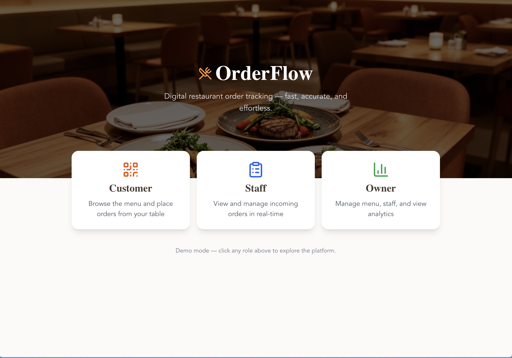
_Landing page with role-based access options_

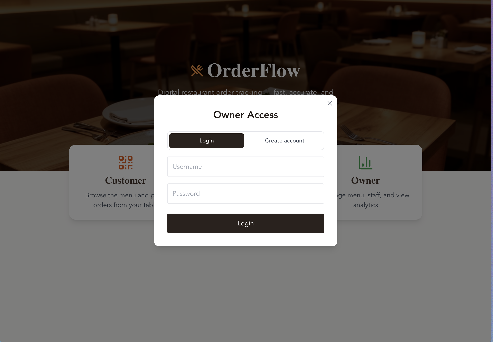
_Owner login with validation_

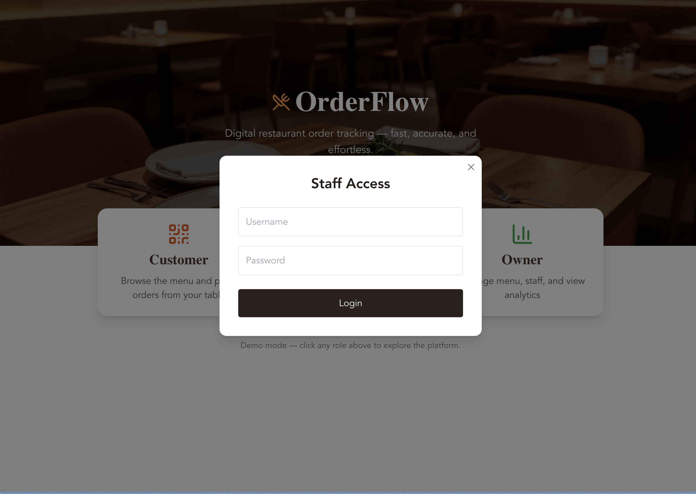
_Staff login with validation_

### Customer Experience (QR Code Ordering)

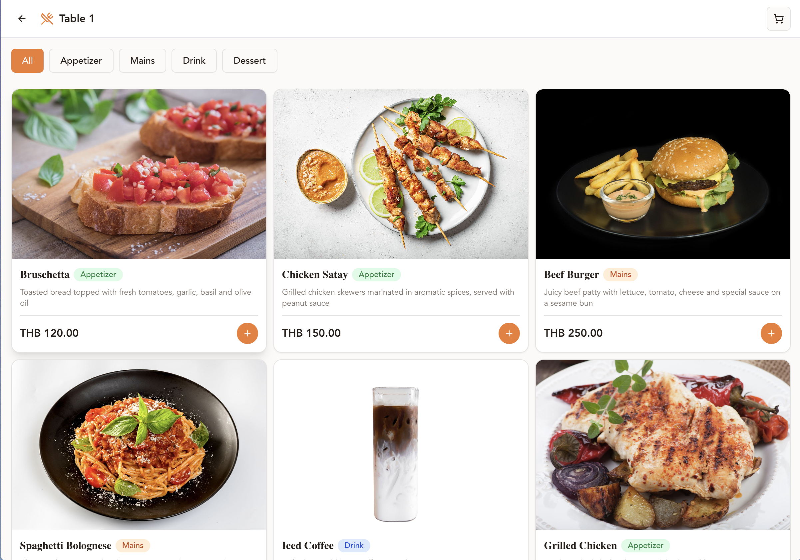
_Customer menu view after scanning QR code_

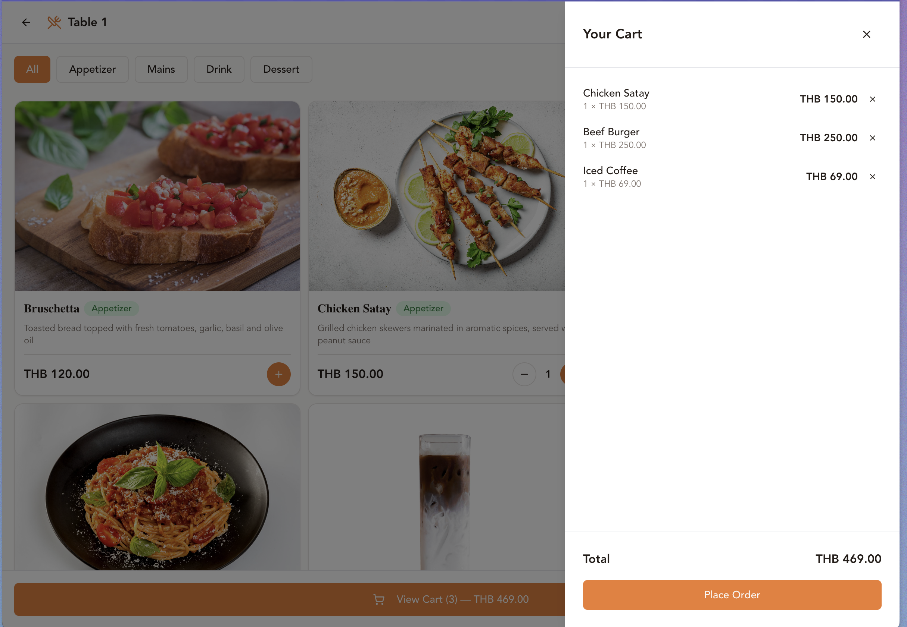
_Cart with selected items and total_

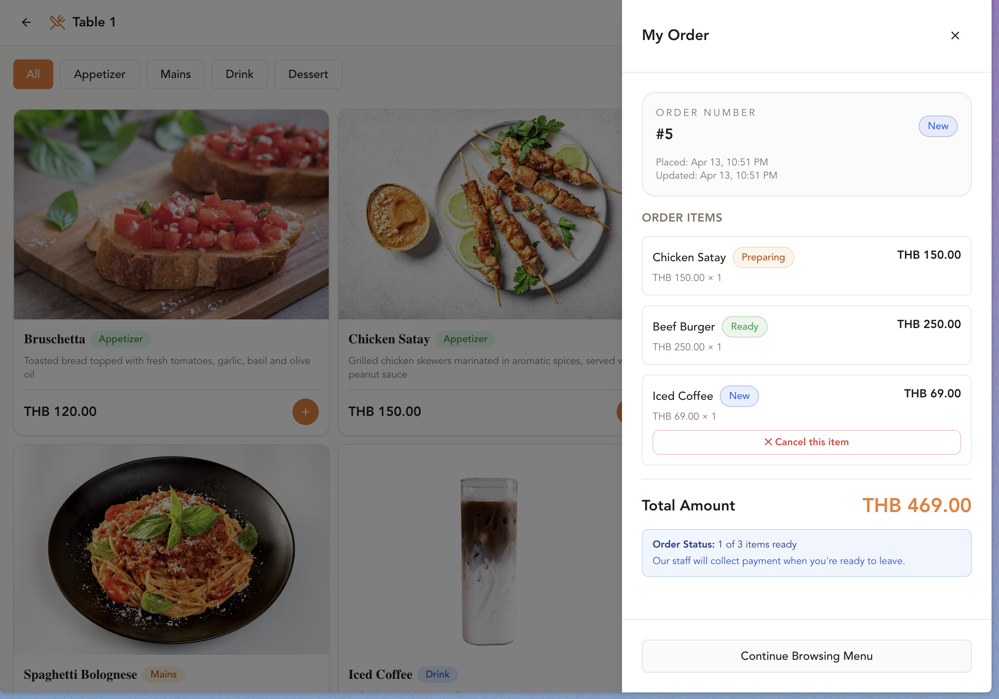
_Real-time order tracking with per-item status_

### Owner Dashboard

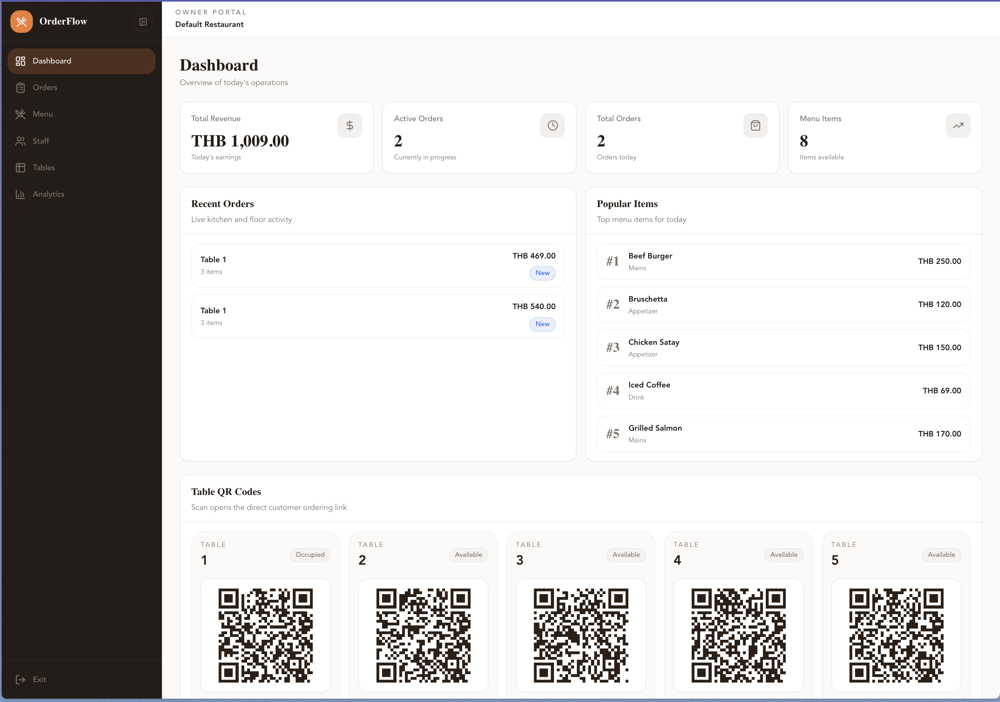
_Dashboard overview with key statistics_

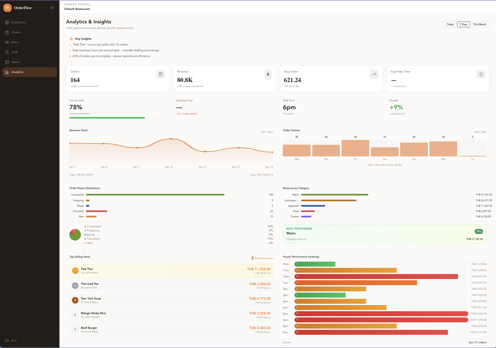
_Comprehensive analytics with charts and insights_

### Menu Management

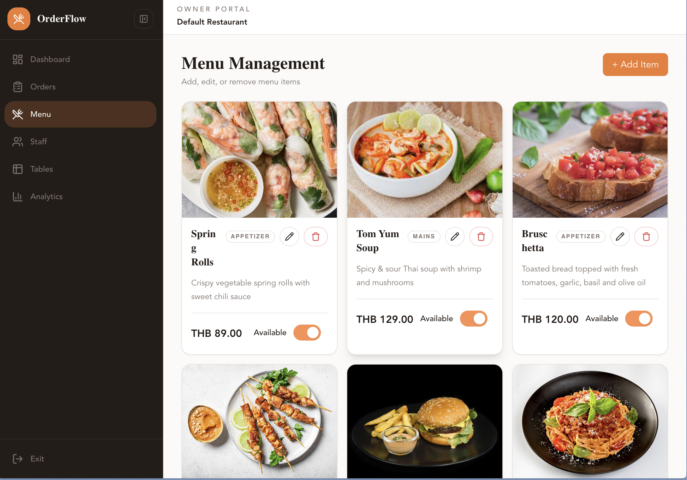
_Menu management with image upload and CRUD operations_

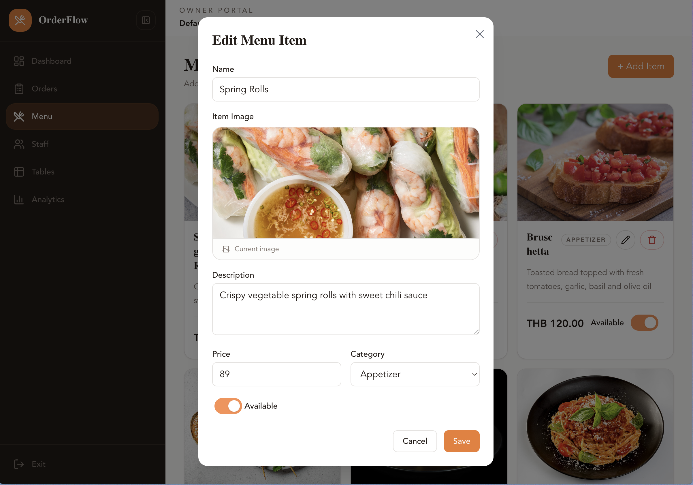
_Edit menu item modal with AWS S3 image upload_

### Order Management

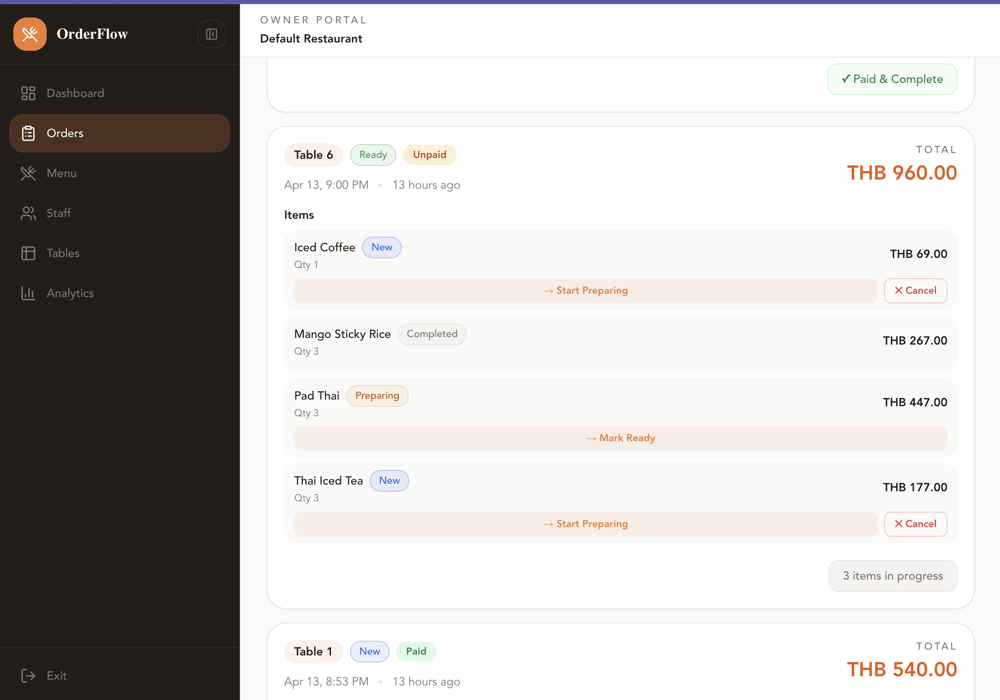
_Order management dashboard for staff and owner_

### Staff Management (Owner Only)

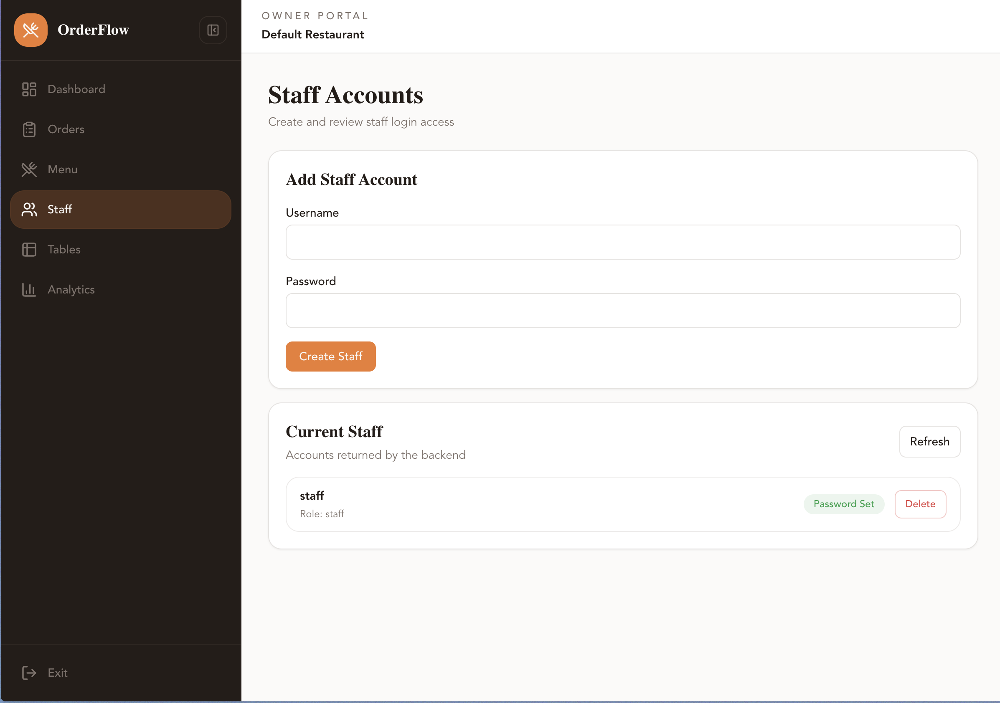
_Create and manage staff accounts_

### Table Management (Owner Only)

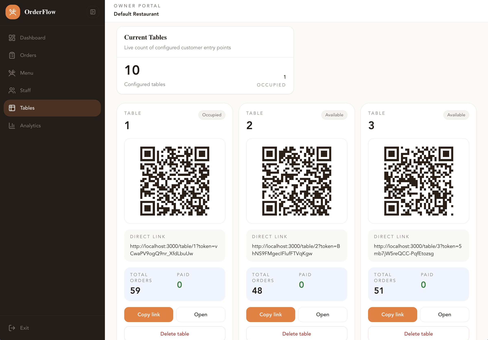
_Table management with unique QR codes for each table_

> **Note:** Screenshots will be added before final submission. System is fully functional and ready for demonstration.

---

## 📝 License

This project is developed for educational purposes as part of a Software Architecture course.

---

## 👨‍💻 Development

**Project Type:** Software Architecture Course Project  
**Focus:** Layered Architecture, Role-Based Access Control, Order Workflow Management  
**Technologies:** FastAPI, Vue 3, SQLAlchemy, JWT, AWS S3  
**Special Features:** QR Code Ordering, Per-Item Status Tracking, Thai Localization

---

## 🤝 Contributing

This is an academic project. For suggestions or issues, please contact the development team.

---
